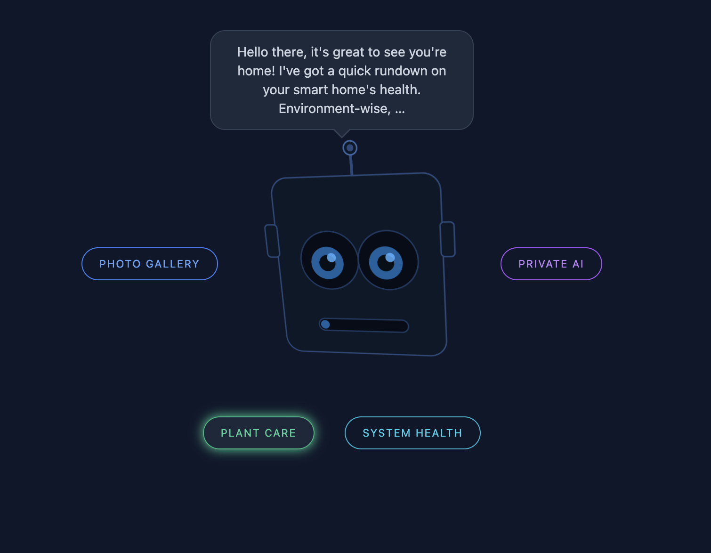

# Papu's Home

A self-hosted home automation system built around ESP32 sensor nodes, an MQTT broker, a PostgreSQL-backed dashboard, and an AI robot head with face recognition and LLM responses.



---

## What it does

**Plant & environment monitoring** — ESP32 nodes report soil moisture, water tank level, temperature, humidity, and air quality over MQTT. A web dashboard shows live readings and watering history. Watering can be triggered manually or fires automatically on a schedule.

**AI robot head** — A webcam on your local machine runs fast face detection (~10 fps) and streams frames to a GPU server for CNN-based recognition. A pan/tilt servo system (in progress) keeps recognized faces centered. Identified visitors get a personalized voice greeting generated by a local LLM.

---

## Hardware

### Server

| Component         | Notes                                                 |
| ----------------- | ----------------------------------------------------- |
| Any Linux machine | Runs Docker Compose                                   |
| NVIDIA GPU        | Optional — needed for face recognition and Ollama LLM |

### ESP32 nodes

| Component                   | Board                                  | Purpose                            |
| --------------------------- | -------------------------------------- | ---------------------------------- |
| Soil moisture sensor        | Adafruit Metro ESP32-S3                | Reports moisture; triggers pump    |
| Submersible pump            | QWORK DC 12V Water Pump                | Watering                           |
| Ultrasonic sensor (HC-SR04) | 4-20mA, DC24V Liquid Level Transmitter | Water tank level                   |
| BME680 breakout             | ESP32-C3 Super Mini                    | Temperature, humidity, IAQ         |
| RGB LED matrix              | ESP32 DevKit                           | Scrolling display (weather, stats) |

### Robot head (optional)

| Component          | Notes                                               |
| ------------------ | --------------------------------------------------- |
| USB webcam         | Runs on any machine and sends frames to home server |
| Pan/tilt servo kit | Work in progress                                    |

---

## Quick start

**Prerequisites:** Docker + Docker Compose, Node.js 18+

```bash
git clone https://github.com/YOUR_USERNAME/home.git
cd home

# Copy config templates and fill in your values
cp .env.example .env
cp hardware/lib/shared/config.h.example hardware/lib/shared/config.h

# Start the server stack (nginx, API, Postgres, MQTT)
npm run up

# Initialize the database
npm run db:migrate
```

The dashboard is now at `http://YOUR_SERVER_IP`.

**With a GPU** (face recognition + LLM):

```bash
docker compose --profile gpu up -d
```

**Enroll a face** (from the machine with the webcam):

```bash
npm run vision:enroll -- <userId> <displayName> /path/to/photos/
```

This trains the face recognition model and registers the display name in the database. The robot will greet that person by their display name when they appear on camera.

See [SETUP.md](SETUP.md) for firmware flashing, full face enrollment options, and troubleshooting.

---

## Architecture

```
ESP32 nodes
  └─ MQTT (mosquitto) ──► Node.js API ──► PostgreSQL
                               │
                           nginx (port 80)
                           Web dashboard

MacBook webcam
  ├─ Haar detection → robot/vision/tracking  (pan/tilt, low latency)
  └─ JPEG frames   → robot/vision/frame
                           │
                     robot-vision-worker (GPU, dlib CNN)
                           │
                     robot/vision/result  (name, confidence)
                           │
                     Ollama (llama3.2) ──► TTS greeting
```

### Services

| Service               | Port        | Description                        |
| --------------------- | ----------- | ---------------------------------- |
| `nginx`               | 80          | Static dashboard                   |
| `api`                 | 5000        | Node.js/Express REST API           |
| `db`                  | —           | PostgreSQL 15                      |
| `mqtt-broker`         | 1883 / 9001 | Eclipse Mosquitto                  |
| `ollama`              | 11434       | Local LLM (GPU profile)            |
| `robot-vision-worker` | —           | CNN face recognition (GPU profile) |

---

## Stack

- **Firmware:** C++ / Arduino (PlatformIO)
- **Backend:** Node.js, Express, Kysely, PostgreSQL
- **Frontend:** Vanilla JS, Tailwind CSS
- **Vision:** Python, dlib, OpenCV, CUDA
- **LLM:** Ollama (`llama3.2`)
- **Infra:** Docker Compose, Mosquitto MQTT, nginx, Cloudflare Access (optional)

---

## Roadmap

- [ ] Servo control service (pan/tilt head tracking)
- [ ] Local speech-to-text (Whisper)
- [ ] TTS voice responses
- [ ] Person-personalized LLM context
- [ ] Mobile-friendly dashboard
- [ ] Setup video walkthrough

---

## License

MIT
